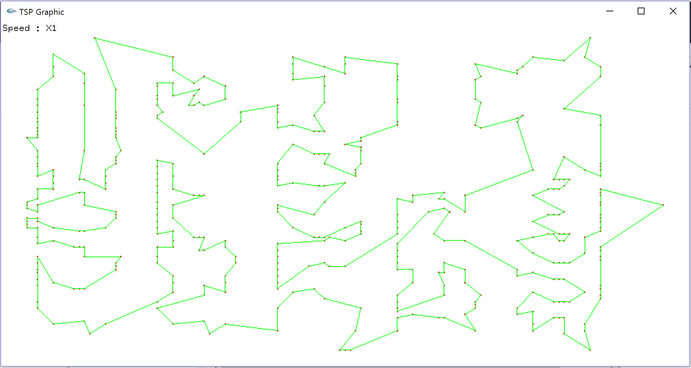
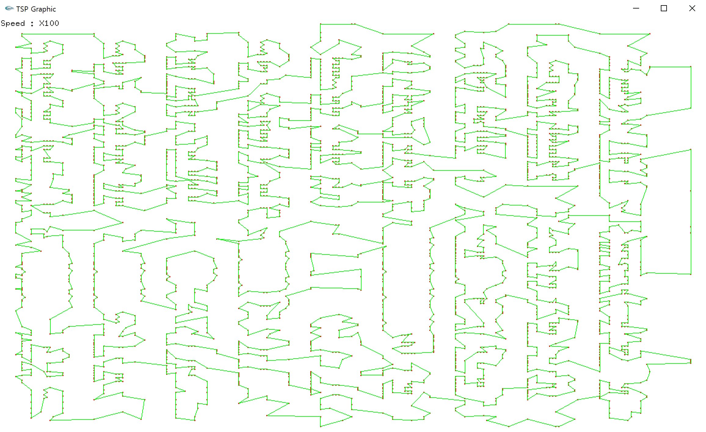
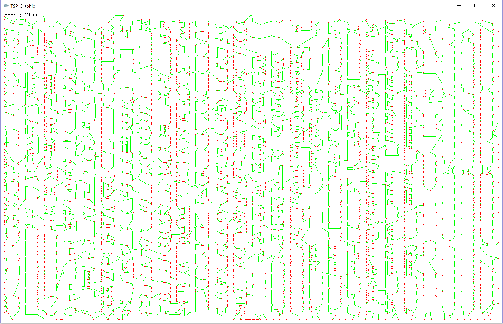

# VLSI-SMT-Chip-Mount-Project
VLSI-SMT Chip Mount Project using TSP search algorithm and visualization with openGL

#### Heuristic algorithm: Kruskal’s algorithm
#### Optimization algorithm: 2-Opt & 3-Opt

> ### VLSI 411 chips

> ### VLSI 3119 chips

> ### VLSI 10150 chips

